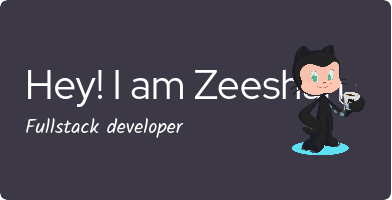

---

  

---

<h1 align="center">👋 Hey there! I'm Zeeshan Ali</h1>

  <em>Your friendly neighborhood Full-Stack Developer who loves turning ideas into reality!</em>  
   
  

---

### 🚀 A Bit About Me:

- 💻 **Full-Stack Developer:** I create engaging web applications, diving deep into both frontend and backend magic.
- 🌱 **Tech Explorer:** Always on the lookout for new tools and technologies, especially **Next.js** and **React Native**. The learning never stops!
- ✍️ **Tech Writer:** I love sharing my journey and insights through articles and tutorials. Knowledge is meant to be shared!
- 🧩 **Problem Solver:** You’ll often find me solving coding challenges on **LeetCode**—it's like a brain workout for me!
- 🎮 **Hobbies:** When I need a break, I enjoy gaming and watching anime. Got any good recommendations? 🍿

  

---

### 🛠️ My Tech Toolbox:

  
  
  
  
   
  
  
  
  
  
  

  

---

### 📈 My GitHub Stats:

  
  

  

---

### 💡 Fun Facts:

- 🖥️ **I use Arch Linux:** My setup is like my coding style—customized and unique!
- 🎮 **Anime & Gaming:** I unwind with some great games and episodes. If you have recommendations, send them my way!  
- ☕ **Coffee Enthusiast:** Fueling my late-night coding marathons one cup at a time.

  
   
  <strong>Let’s connect and create something amazing together!</strong>

---

  

